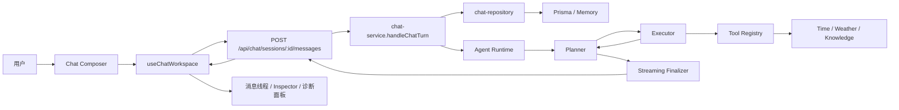
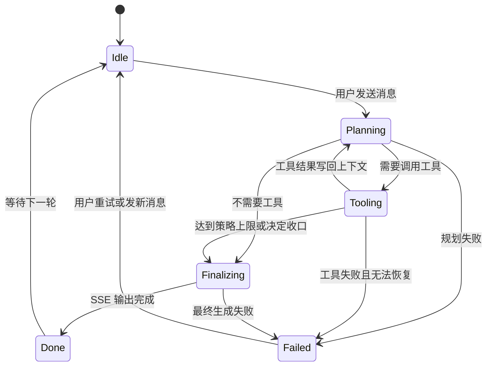

# 企业级 Agent 项目流程图

这份文档描述当前项目在“企业级底座”方向上的核心请求链路、状态机和模块职责。

## 总览流程

## 状态机

## 模块职责

### 1. API 层

- 接收用户请求
- 将 runtime 输出编码成 SSE 事件流
- 对外暴露 `traceId`

### 2. Service 层

- 创建 `turnId` 与 `traceId`
- 持久化用户消息
- 组装上下文窗口
- 调用 Agent runtime
- 在流结束后持久化 assistant turn

### 3. Runtime 层

- `planner.ts`：决定下一步动作
- `executor.ts`：执行工具、处理超时与重试
- `streaming.ts`：流式生成最终回答
- `runtime.ts`：串联 provider、planner、executor、streaming

### 4. Tool Registry

每个工具声明：

- `displayName`
- `category`
- `riskLevel`
- `source`
- `timeoutMs`
- `retryable`

### 5. Repository 层

- `chat-repository.ts`：统一门面与 fallback
- `chat-repository-prisma.ts`：真实持久化
- `chat-repository-memory.ts`：开发兜底

## 企业级底座已经具备的要素

- `turnId`
- `traceId`
- runtime policy
- 结构化工具结果
- Agent step 轨迹
- Inspector 调试面板
- SSE 流式阶段反馈

## 下一步企业级化重点

1. 工具治理策略
2. 自动化测试
3. `turn/run` 级别建模
4. 知识库长期记忆
5. 成本与质量评估
